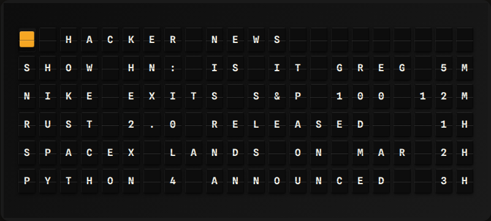

# RSS Reader Plugin

Display the newest headlines from any RSS 2.0 or Atom feed.

**→ [Setup Guide](./docs/SETUP.md)** - Configuration instructions

## Overview

The RSS Reader plugin fetches a single feed URL, parses it with the Python standard library
(`xml.etree.ElementTree`, no third-party feed parser) and exposes the newest items as template
variables. Both `<rss><channel><item>` and Atom `<feed><entry>` documents are supported. Item
titles have HTML tags stripped and whitespace collapsed, and each item carries a short relative
age such as `5M`, `2H` or `3D` computed from its `pubDate` / `updated` / `published` element.



## Template Variables

```
{{rss_reader.feed_title}}       # Feed title
{{rss_reader.title}}            # Newest item title
{{rss_reader.age}}              # Newest item age (5M, 2H, 3D; empty if unknown)
{{rss_reader.link}}             # Newest item URL
{{rss_reader.item_count}}       # Number of items exposed

{{rss_reader.items.0.title}}    # Nth item title (0-based, up to max_items - 1)
{{rss_reader.items.0.age}}      # Nth item age
{{rss_reader.items.0.link}}     # Nth item URL
```

## Example Templates

### News Ticker (Recommended)

```
{{rss_reader.feed_title}}
{{rss_reader.items.0.title}}
{{rss_reader.items.1.title}}
{{rss_reader.items.2.title}}
{{rss_reader.items.3.title}}
{{rss_reader.items.4.title}}
```

### Newest Item Only

```
{{rss_reader.feed_title}}

{{rss_reader.title|wrap}}
```

## Configuration

| Setting | Type | Default | Description |
|---------|------|---------|-------------|
| enabled | boolean | false | Enable/disable the plugin |
| feed_url | string | — | RSS 2.0 or Atom feed URL (required) |
| max_items | integer | 5 | Newest items to expose (1–10) |
| refresh_seconds | integer | 900 | Re-fetch interval (minimum 300) |

## Data Source

Any publicly reachable RSS 2.0 or Atom feed. No API key is required. The plugin sends a
`FiestaBoard` User-Agent and times out after 10 seconds; keep `refresh_seconds` reasonable so
you are not hammering the feed host.

## Development

```bash
pip install -r requirements-dev.txt
pytest tests/ -v --cov=.
```

Tests mock all HTTP calls; see `tests/test_plugin.py` for the RSS and Atom fixtures.

## Author

FiestaBoard Team
